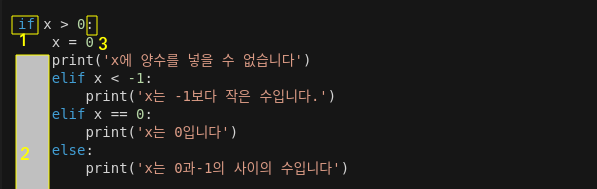

# 파이썬(Python)
이번 포스트에서는 파이썬에 관해 쓰려고 합니다.  
일단 파이썬은 객체지향언어라고 사람이 코드를 짜기 쉽게 읽고 이해하며 만들 수 있는 것이 목표인 언어로 이해하면 좋습니다.  
제가 파이썬의 모든 것을 해보지 않았기에 실수도 있고 모르는 것이 많습니다.   
댓글로 알려주시면 감사해요.

일단 아래 나올 것들을 사용하기 위해 간략히 짚고 넘어가겠습니다.   



## 흐름제어 도구
파이썬에서 제공하는 한국어판 설명을 참고하여 언어선택을 하였습니다.  
함수의   

### 1.if문(조건문)
if문은 조건을 통과하면 그 안에 있는 것을 작동시킬 수 있습니다.   
간단하게 부등호도 사용이 가능하다. 같은 것인지 확인하는 것은 등호를 두번 사용한다.  
elif는 else if의 줄임말로 그냥 한국말로 '그렇지 않고 이러면'으로 생각하면 된다.  
else는 그냥 '그렇지 않으면'으로 위의 조건들이 아니면 실행을 한다.

``` python
if x > 0:
    x = 0
    print('x에 양수를 넣을 수 없습니다')
    elif x < -1:
        print('x는 -1보다 작은 수입니다.')
    elif x == 0:
        print('x는 0입니다')
    else:
        print('x는 0과-1의 사이의 수입니다')
```

### 2.for문(반복문)
말 그대로 for문 안에 있는 것을 반복하는 것입니다.  
``` python
for 


```


---

참고링크  
[python](https://docs.python.org/ko/3.7/tutorial/controlflow.html)  
[객체지향(OPP)](http://schoolofweb.net/blog/posts/%ED%8C%8C%EC%9D%B4%EC%8D%AC-oop-part-1-%EA%B0%9D%EC%B2%B4-%EC%A7%80%ED%96%A5-%ED%94%84%EB%A1%9C%EA%B7%B8%EB%9E%98%EB%B0%8Doop%EC%9D%80-%EB%AC%B4%EC%97%87%EC%9D%B8%EA%B0%80-%EC%99%9C-%EC%82%AC%EC%9A%A9%ED%95%98%EB%8A%94%EA%B0%80/)

