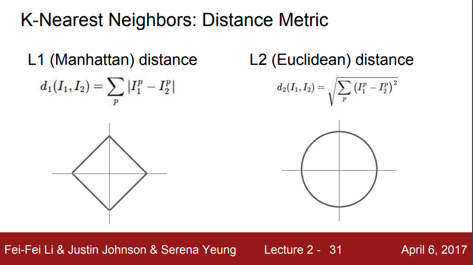

# CV(computer vision)
사람이 사진을 볼 때 사물을 인식하는 것은 매우 쉽게 느껴지지만, 컴퓨터가 볼 때 인식을 하거나 파악하는 것은 매우 어렵습니다.   
## Semantic Gap
한국말로 정확히 어떻게 표현할 지 몰라 그대로 가져왔습니다. 이해한 의미로는 컴퓨터가 보는 이미지의 데이터는 숫자의 배열이고 거기다 색상까지 추가하면 3차원 배열이므로 그러한 차이로 생기는 문제로 이해하였습니다. 저 차이로 인해 생기는 어려움은 다음과 같습니다. 
-  [Viewpoint variation ](https://drive.google.com/file/d/1FfyVH5DdLTklUBioydtFZDpYoWcunPzG/view?usp=sharing)  
카메라가 조금만 움직여도 완전히 다른 값을 나타나 어렵다.
- [Illumination](https://drive.google.com/file/d/1zpWKYjDIbVCTWeWDWdJx04HT05U-msgM/view?usp=sharing)  
조명의 유무나 세기등에 의해 다른 값이 나와 어려움이 있다.
- [Deformation ](https://drive.google.com/file/d/1VNxq-7lCukNQ1Jnv23yx0TbaNSSd3L7p/view?usp=sharing)  
일반적이지 않은 모습이면 가령 고양이가 평소에 배를 잘 안보여주니까 배를 깐 모습이면 고양이로 분류하기 힘들다.
- [Occlusion](https://drive.google.com/file/d/1rEN2V5c4v-45OZgr0ETB-dN8BJQlIpgR/view?usp=sharing)  
숨어있거나 일부분만 드러나있는 사진에서는 구별하기 힘들다.
- [Background Clutter](https://drive.google.com/file/d/1znYWjYwkHbPUqjeS1i0R8k2tvYO20c3j/view?usp=sharing)  
배경의 유사성으로 구별하기 힘들다.
- [intraclass variation](https://drive.google.com/file/d/1fAf3Bo02J-Fy6ZIbrRWMMwlavsL6Uk0H/view?usp=sharing)  
고양이로 예시로 보면 떼걸룩이 있고 치즈냥이도 있는데 이것을 같은 고양이로 구별하기 힘듭니다.  

그러면 어떻게 컴퓨터가 인식을 할 수 있게 만들 수 있을까요?
## Data-Driven Approach
한 가지 방법으로 데이터 기반으로 접근하는 방법이 있습니다.  
1. 이미지와 그 해당하는 라벨(분류)를 가진 데이터 셋을 수집해야합니다.
2. 머신러닝으로 훈련시킨다.
3. 새 이미지로 평가를 한다.

기본틀은 위와 같습니다.  
강의에서는 CIFAR10이라는 데이터셋을 사용하였습니다.  
10개의 라벨을 가지고 있고 트레인용 이미지 5만개 테스트용 이미지 1만개를 가지고 있습니다.  

데이터가 비슷한지 비교하기 위한 방법으로 새로 본 데이터(사진)를 일일히 다 익힌 데이터와 비교를 해주는 상황입니다.   
코드로 예를 보면 다음과 같습니다.  

### NearestNeighbor(NN)

``` python
class NearestNeighbor:
    def __init__(self):
        pass
    
    def train(self, X, y):
        self.Xtrain = X
        self.ytrain = y
    
    def predict(self, X):
        num_test = X.shape[0]
        Ytest = np.zeros(num_test, dtype = self.ytrain.dtype)
        for i in xrange(num_test):
            distances = np.sum(np.abs(self.Xtrain - X[i,:]), axis = 1)
            min_index = np.argmin(distances)
            Ytest[i] = self.ytrain[min_index]
        
        return Ytest
```  
train에는 정보를 기억하는 것 이외에는 없습니다. 아주 빠른 훈련이 되는 것입니다.  
대신 predict를 보게 되면 저장된 데이터를 새로운데이터와 비교하며 거리를 측정합니다.  
빅오로 표현해보면 train은 O(1), predict는 O(N)로 나옵니다.[BigO](https://noahlogs.tistory.com/27)  
훈련보다 예측할 때 더 시간이 오래걸려 별로 좋지 못한 모델입니다.
일단 NN은 


