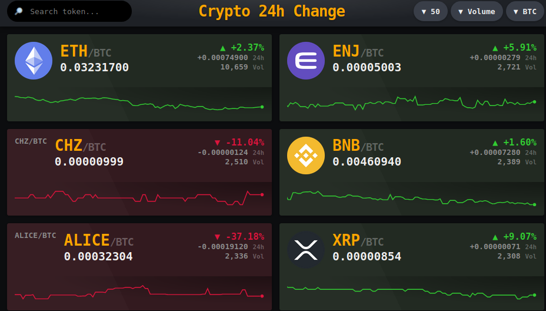

# 웹서비스 시도
최근 flask를 통해 배운 python을 웹에서 구동하기를 내 블로그와 연동하고 싶었습니다.  
거기에 주식 예측하는 것을 실시간으로 구현해보는 것이 이번 프로젝트의 목표입니다.  
github pages(블로그)는 정적으로 웹을 구현해주는 것으로 알고 있습니다.  
반면 flask로 실시간으로 작업하는 것은 동적으로 작동하기에 heroku를 이용하여,  
따로 배포를 해서 back-end로 필요한 작업들을 하고 front-end를 깃허브 블로그에 연결하는 것이 목표입니다.

## 현재 진행도는 실시간으로 비트코인의 변화만 받아서 보여주는 정도입니다.  

# 대략적인 목표 

<b> 이미지 클릭시 진행중인 사이트 이동</b>
